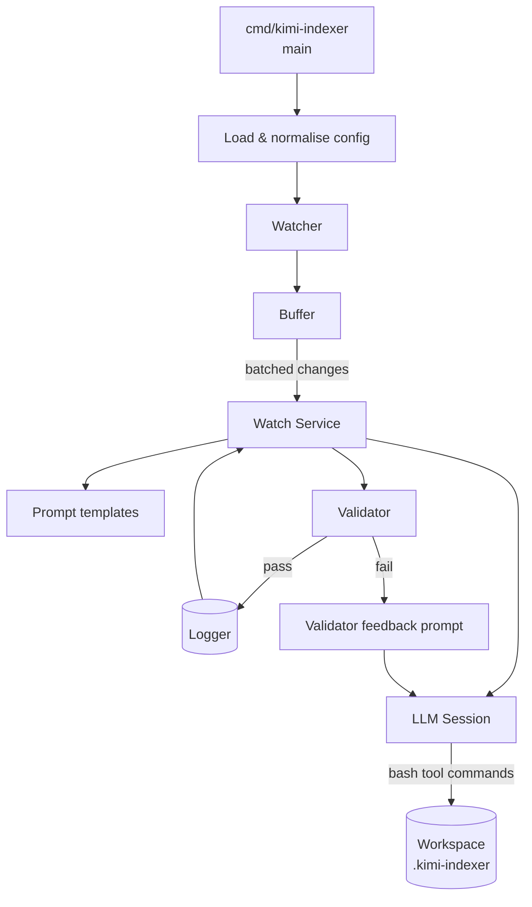

# Core Package Overview

The `core` directory provides the building blocks that power the Kimi indexer runtime.  
Packages are designed to be composed by the CLI entry (`cmd/kimi-indexer`) and external orchestration layers.

## Key Components

- `config`: loads YAML config files, applies CLI overrides, normalises paths, and validates required settings.
- `watcher`: wraps `fsnotify` to stream file-system events under the configured root with glob & extension filters.
- `buffer`: deduplicates watcher events, merges semantics (create/update/delete), and signals when batches are ready.
- `watch`: coordinates batched changes, renders prompt templates, drives the LLM session, and runs the validator feedback loop (up to 100 retries).
- `validator`: checks the `.kimi-indexer/` directory against structural rules and JSON schemas defined in `docs/design/storage-design.md`.
- `internal/prompts`: ships the initialize/watch prompt templates embedded into the binary.
- `logging`: offers coloured, multi-line aware logging with `Debug / Info / Warn / Error / Silent` thresholds.

## High-Level Flow

- The CLI loads configuration, initialises watcher/buffer/service instances, and would pass in a real LLM session factory.
- On each batch, the watch service builds prompts, the LLM mutates files via Kimi’s bash tool, and the validator keeps looping until the index passes.
- Logging is injected into every step to provide structured, multi-line aware debug output.

## Usage Notes

- Use `go run ./cmd/kimi-indexer --print-config` to inspect the resolved configuration.
- Provide your own `SessionFactory` implementation (wrapping Kimi’s SDK) and a long-running loop to keep watch mode alive.
- The validator can be reused standalone to gate CI pipelines or manual index edits.

