# Core 模块代码架构文档

> 本文档使用 Mermaid UML 自顶向下描述 `core/` 模块的完整架构。

## 1. 目录结构

```
core/
├── cmd/
│   └── indexer/
│       └── main.go              # CLI 入口点，程序主逻辑
└── internal/
    ├── config/
    │   └── config.go            # 配置加载与管理
    ├── watcher/
    │   └── watcher.go           # 文件系统监控
    ├── buffer/
    │   └── buffer.go            # 变更事件缓冲
    ├── trigger/
    │   └── trigger.go           # 触发策略管理
    └── analyzer/
        ├── analyzer.go          # 分析处理器（调用 Kimi API）
        └── prompts/
            └── analyze.md       # 分析提示词模板
```

---

## 2. 系统架构总览

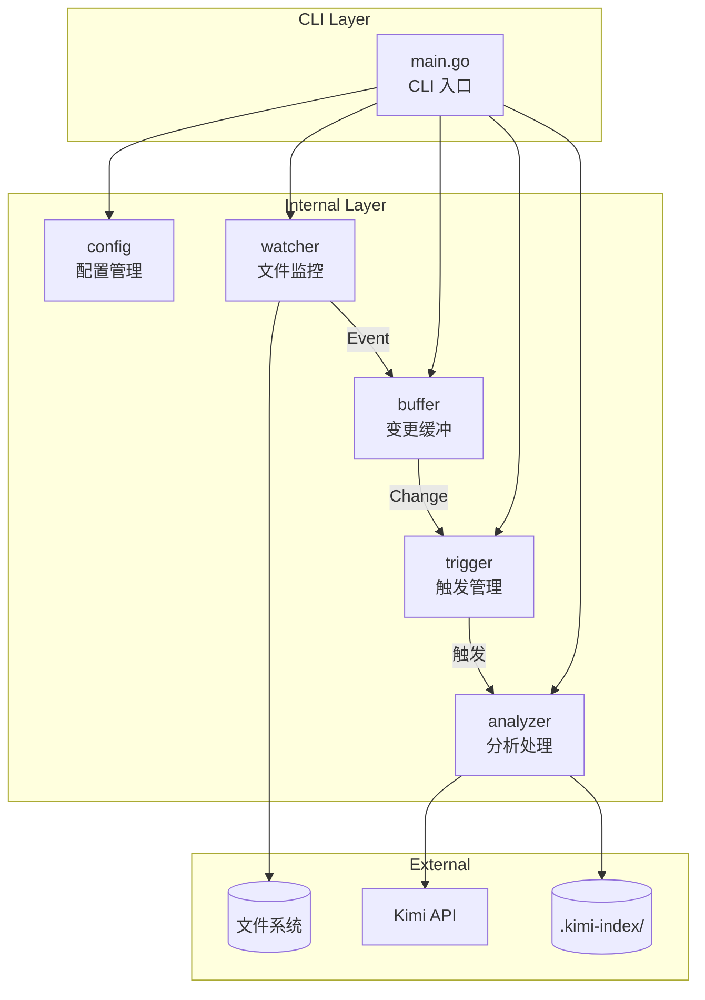
```mermaid
graph TB
    subgraph "CLI Layer"
        Main[main.go<br/>CLI 入口]
    end

    subgraph "Internal Layer"
        Config[config<br/>配置管理]
        Watcher[watcher<br/>文件监控]
        Buffer[buffer<br/>变更缓冲]
        Trigger[trigger<br/>触发管理]
        Analyzer[analyzer<br/>分析处理]
    end

    subgraph "External"
        FS[(文件系统)]
        KimiAPI[Kimi API]
        IndexDir[(.kimi-index/)]
    end

    Main --> Config
    Main --> Watcher
    Main --> Buffer
    Main --> Trigger
    Main --> Analyzer

    Watcher --> FS
    Analyzer --> KimiAPI
    Analyzer --> IndexDir

    Watcher -->|Event| Buffer
    Buffer -->|Change| Trigger
    Trigger -->|触发| Analyzer
```

---

## 3. 组件依赖关系

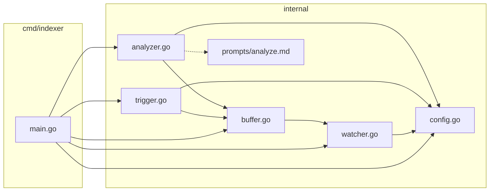
```mermaid
graph LR
    subgraph cmd/indexer
        main[main.go]
    end

    subgraph internal
        config[config.go]
        watcher[watcher.go]
        buffer[buffer.go]
        trigger[trigger.go]
        analyzer[analyzer.go]
        prompts[prompts/analyze.md]
    end

    main --> config
    main --> watcher
    main --> buffer
    main --> trigger
    main --> analyzer

    watcher --> config
    trigger --> config
    trigger --> buffer
    buffer --> watcher
    analyzer --> config
    analyzer --> buffer
    analyzer -.-> prompts
```

---

## 4. 数据流图

```mermaid
flowchart LR
    subgraph Input
        FS[文件系统变更]
    end

    subgraph Processing
        W[Watcher] -->|Event| B[Buffer]
        B -->|Change[]| T[Trigger]
        T -->|触发回调| A[Analyzer]
    end

    subgraph Output
        A -->|prompt| K[Kimi API]
        K -->|response| A
        A -->|写入| I[.kimi-index/]
    end

    FS --> W
```

---

## 5. 运行模式

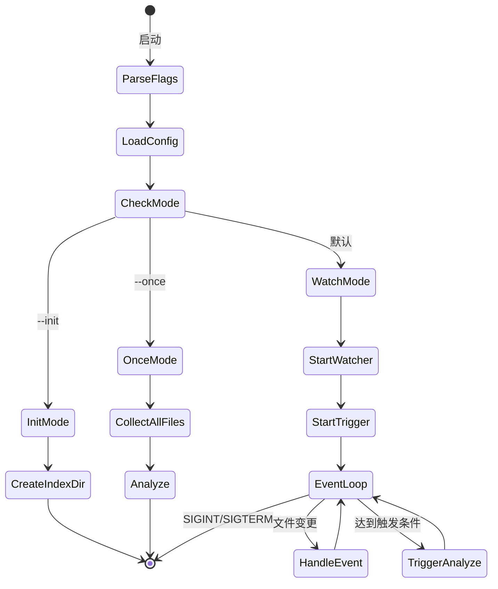
```mermaid
stateDiagram-v2
    [*] --> ParseFlags: 启动

    ParseFlags --> LoadConfig
    LoadConfig --> CheckMode

    CheckMode --> InitMode: --init
    CheckMode --> OnceMode: --once
    CheckMode --> WatchMode: 默认

    InitMode --> CreateIndexDir
    CreateIndexDir --> [*]

    OnceMode --> CollectAllFiles
    CollectAllFiles --> Analyze
    Analyze --> [*]

    WatchMode --> StartWatcher
    StartWatcher --> StartTrigger
    StartTrigger --> EventLoop

    EventLoop --> HandleEvent: 文件变更
    HandleEvent --> EventLoop

    EventLoop --> TriggerAnalyze: 达到触发条件
    TriggerAnalyze --> EventLoop

    EventLoop --> [*]: SIGINT/SIGTERM
```

---

## 6. 各模块详细设计

### 6.1 main.go - CLI 入口

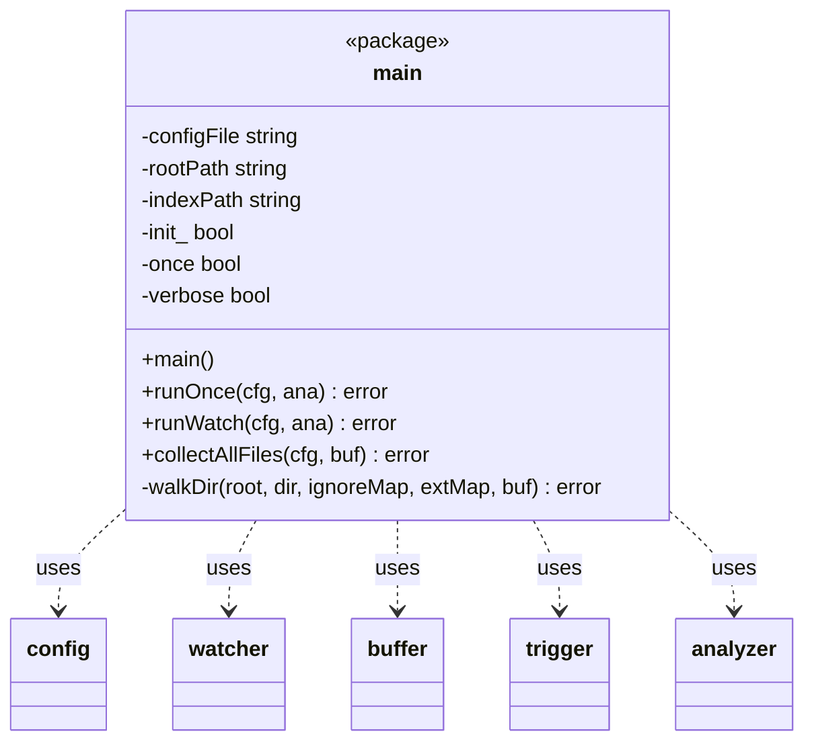
```mermaid
classDiagram
    class main {
        <<package>>
        -configFile string
        -rootPath string
        -indexPath string
        -init_ bool
        -once bool
        -verbose bool
        +main()
        +runOnce(cfg, ana) error
        +runWatch(cfg, ana) error
        +collectAllFiles(cfg, buf) error
        -walkDir(root, dir, ignoreMap, extMap, buf) error
    }

    main ..> config : uses
    main ..> watcher : uses
    main ..> buffer : uses
    main ..> trigger : uses
    main ..> analyzer : uses
```

**职责：**
- 解析命令行参数
- 加载配置
- 根据模式执行不同逻辑
- 协调各组件工作

---

### 6.2 config.go - 配置管理

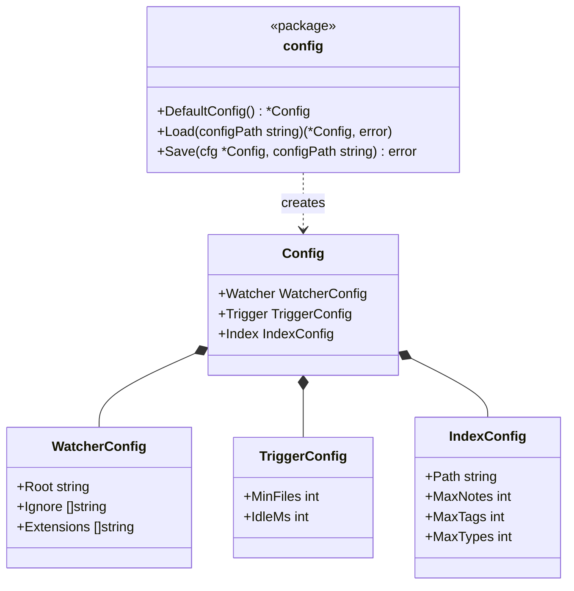
```mermaid
classDiagram
    class Config {
        +Watcher WatcherConfig
        +Trigger TriggerConfig
        +Index IndexConfig
    }

    class WatcherConfig {
        +Root string
        +Ignore []string
        +Extensions []string
    }

    class TriggerConfig {
        +MinFiles int
        +IdleMs int
    }

    class IndexConfig {
        +Path string
        +MaxNotes int
        +MaxTags int
        +MaxTypes int
    }

    Config *-- WatcherConfig
    Config *-- TriggerConfig
    Config *-- IndexConfig

    class config {
        <<package>>
        +DefaultConfig() *Config
        +Load(configPath string) (*Config, error)
        +Save(cfg *Config, configPath string) error
    }

    config ..> Config : creates
```

**配置文件格式** (`.kimi-indexer.yaml`):

```yaml
watcher:
  root: "."
  ignore: ["node_modules", ".git", "dist"]
  extensions: [".ts", ".js", ".go", ".py"]

trigger:
  minFiles: 5
  idleMs: 30000

index:
  path: ".kimi-index"
  maxNotes: 50
  maxTags: 100
  maxTypes: 100
```

---

### 6.3 watcher.go - 文件监控

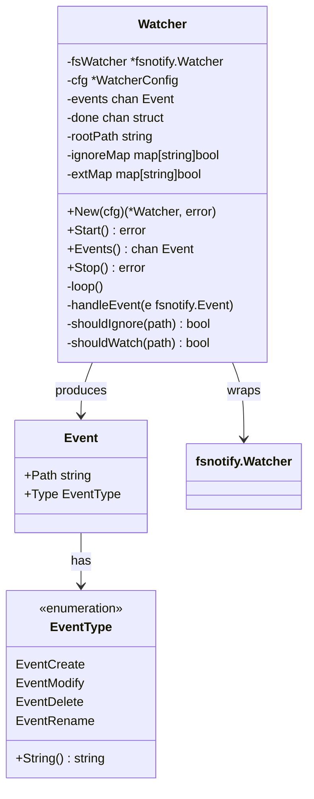
```mermaid
classDiagram
    class EventType {
        <<enumeration>>
        EventCreate
        EventModify
        EventDelete
        EventRename
        +String() string
    }

    class Event {
        +Path string
        +Type EventType
    }

    class Watcher {
        -fsWatcher *fsnotify.Watcher
        -cfg *WatcherConfig
        -events chan Event
        -done chan struct
        -rootPath string
        -ignoreMap map[string]bool
        -extMap map[string]bool
        +New(cfg) (*Watcher, error)
        +Start() error
        +Events() chan Event
        +Stop() error
        -loop()
        -handleEvent(e fsnotify.Event)
        -shouldIgnore(path) bool
        -shouldWatch(path) bool
    }

    Watcher --> Event : produces
    Event --> EventType : has
    Watcher --> fsnotify.Watcher : wraps
```

**监控流程：**

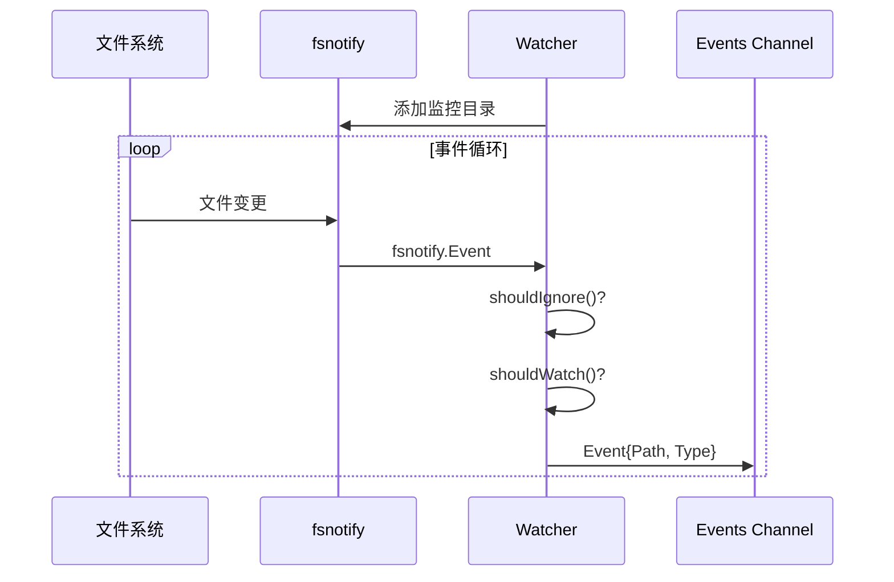
```mermaid
sequenceDiagram
    participant FS as 文件系统
    participant FSN as fsnotify
    participant W as Watcher
    participant C as Events Channel

    W->>FSN: 添加监控目录
    loop 事件循环
        FS->>FSN: 文件变更
        FSN->>W: fsnotify.Event
        W->>W: shouldIgnore()?
        W->>W: shouldWatch()?
        W->>C: Event{Path, Type}
    end
```

---

### 6.4 buffer.go - 变更缓冲

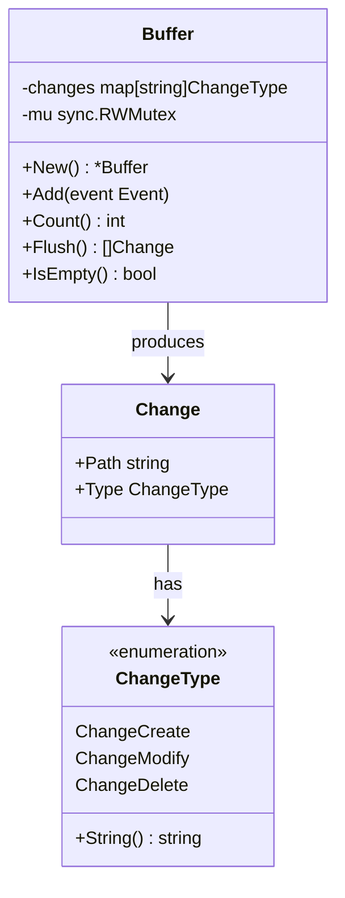
```mermaid
classDiagram
    class ChangeType {
        <<enumeration>>
        ChangeCreate
        ChangeModify
        ChangeDelete
        +String() string
    }

    class Change {
        +Path string
        +Type ChangeType
    }

    class Buffer {
        -changes map[string]ChangeType
        -mu sync.RWMutex
        +New() *Buffer
        +Add(event Event)
        +Count() int
        +Flush() []Change
        +IsEmpty() bool
    }

    Buffer --> Change : produces
    Change --> ChangeType : has
```

**变更合并规则：**

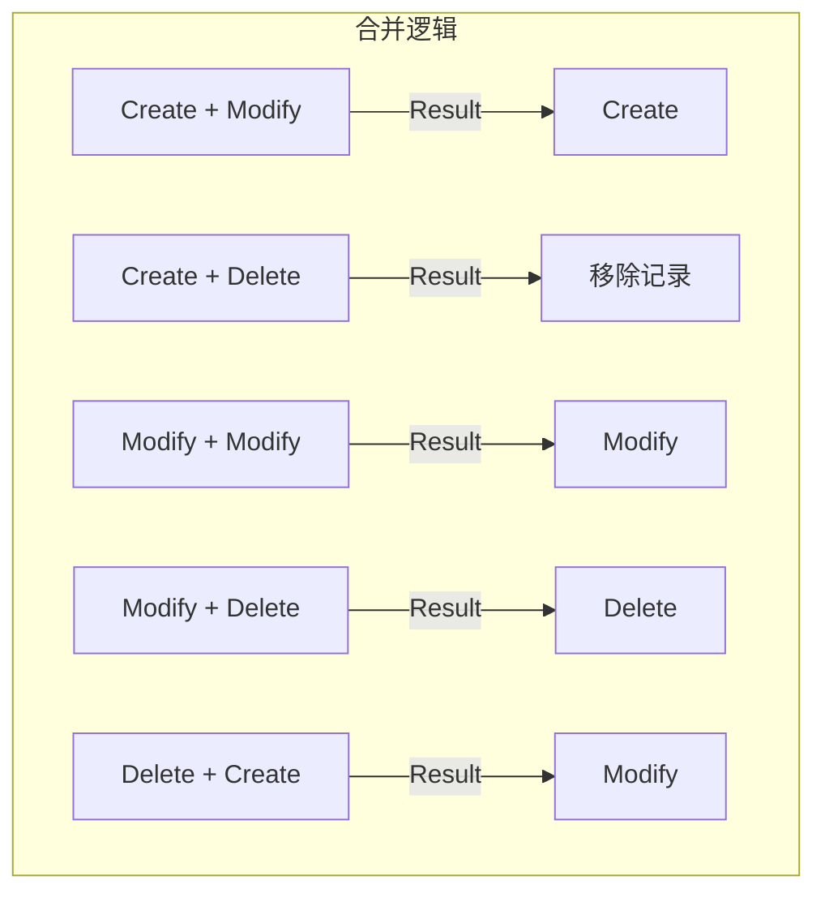
```mermaid
graph TD
    subgraph "合并逻辑"
        A[Create + Modify] -->|Result| B[Create]
        C[Create + Delete] -->|Result| D[移除记录]
        E[Modify + Modify] -->|Result| F[Modify]
        G[Modify + Delete] -->|Result| H[Delete]
        I[Delete + Create] -->|Result| J[Modify]
    end
```

| 旧状态 | 新事件 | 结果 |
|--------|--------|------|
| Create | Modify | Create |
| Create | Delete | 移除 |
| Modify | Modify | Modify |
| Modify | Delete | Delete |
| Delete | Create | Modify |

---

### 6.5 trigger.go - 触发管理

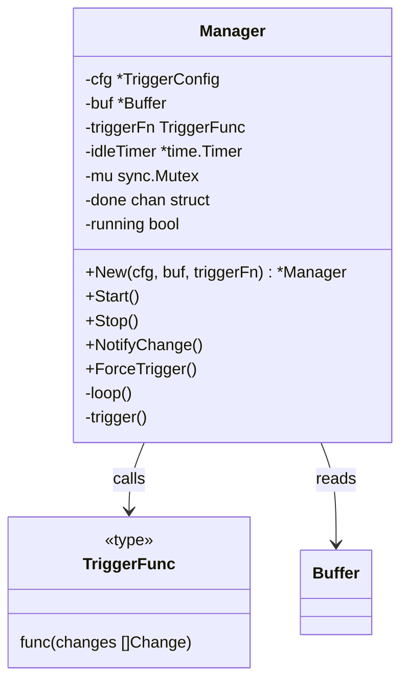
```mermaid
classDiagram
    class TriggerFunc {
        <<type>>
        func(changes []Change)
    }

    class Manager {
        -cfg *TriggerConfig
        -buf *Buffer
        -triggerFn TriggerFunc
        -idleTimer *time.Timer
        -mu sync.Mutex
        -done chan struct
        -running bool
        +New(cfg, buf, triggerFn) *Manager
        +Start()
        +Stop()
        +NotifyChange()
        +ForceTrigger()
        -loop()
        -trigger()
    }

    Manager --> TriggerFunc : calls
    Manager --> Buffer : reads
```

**触发策略：**

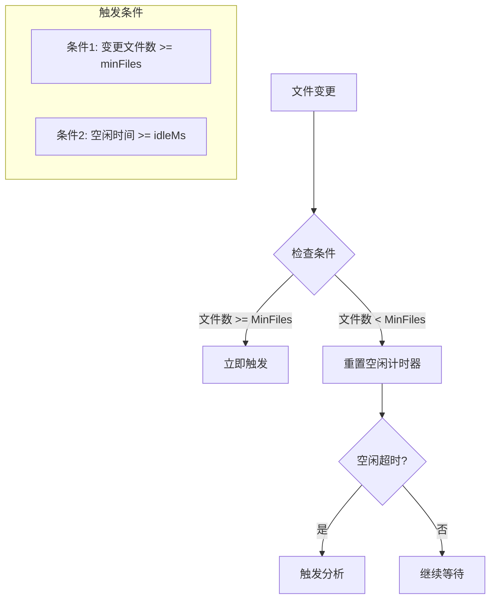
```mermaid
flowchart TD
    A[文件变更] --> B{检查条件}
    B -->|文件数 >= MinFiles| C[立即触发]
    B -->|文件数 < MinFiles| D[重置空闲计时器]
    D --> E{空闲超时?}
    E -->|是| F[触发分析]
    E -->|否| G[继续等待]

    subgraph "触发条件"
        H[条件1: 变更文件数 >= minFiles]
        I[条件2: 空闲时间 >= idleMs]
    end
```

---

### 6.6 analyzer.go - 分析处理器

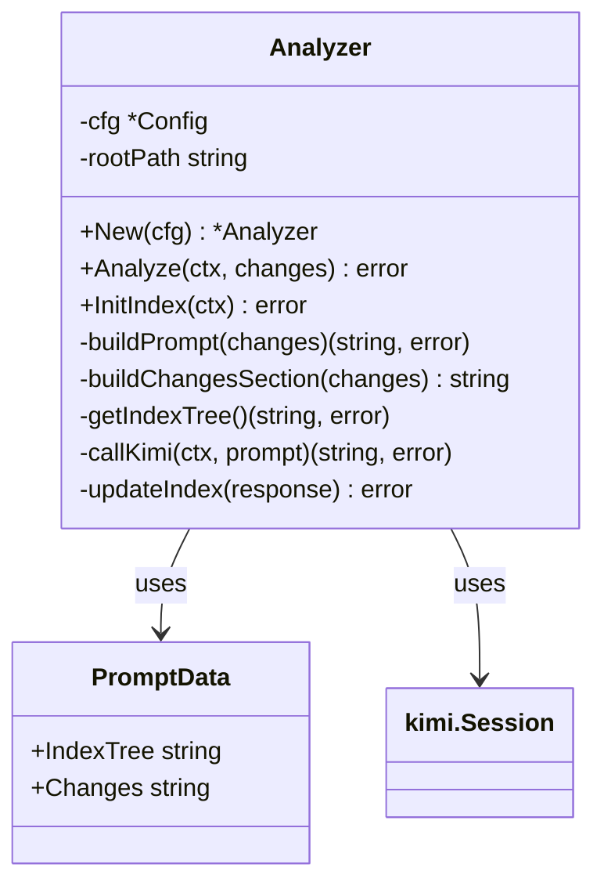
```mermaid
classDiagram
    class PromptData {
        +IndexTree string
        +Changes string
    }

    class Analyzer {
        -cfg *Config
        -rootPath string
        +New(cfg) *Analyzer
        +Analyze(ctx, changes) error
        +InitIndex(ctx) error
        -buildPrompt(changes) (string, error)
        -buildChangesSection(changes) string
        -getIndexTree() (string, error)
        -callKimi(ctx, prompt) (string, error)
        -updateIndex(response) error
    }

    Analyzer --> PromptData : uses
    Analyzer --> kimi.Session : uses
```

**分析流程：**

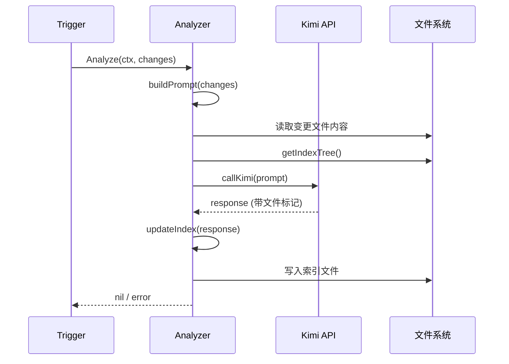
```mermaid
sequenceDiagram
    participant T as Trigger
    participant A as Analyzer
    participant K as Kimi API
    participant FS as 文件系统

    T->>A: Analyze(ctx, changes)
    A->>A: buildPrompt(changes)
    A->>FS: 读取变更文件内容
    A->>FS: getIndexTree()
    A->>K: callKimi(prompt)
    K-->>A: response (带文件标记)
    A->>A: updateIndex(response)
    A->>FS: 写入索引文件
    A-->>T: nil / error
```

**响应解析格式：**

```
---FILE: path/to/file.md---
[文件内容]
---END---
```

---

### 6.7 prompts/analyze.md - 提示词模板

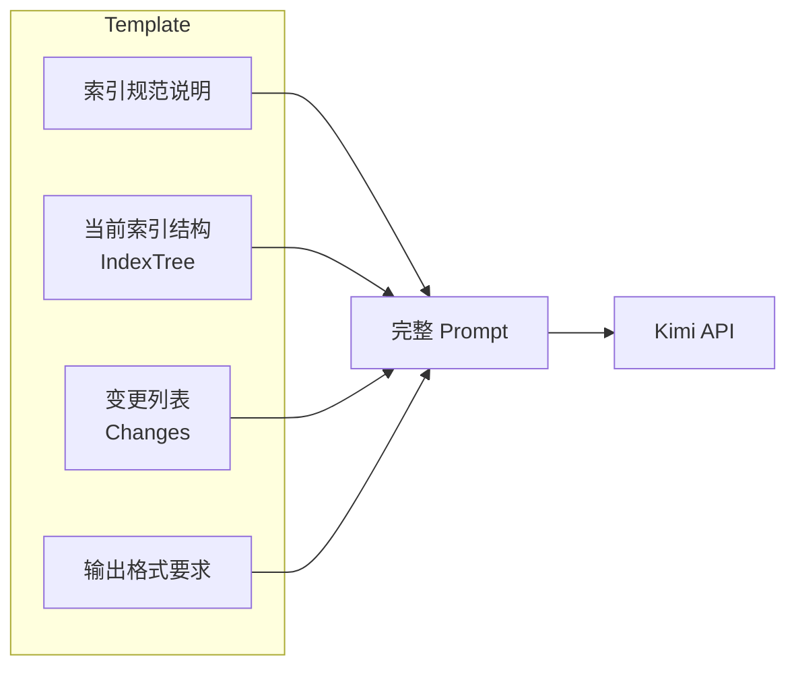
```mermaid
graph LR
    subgraph Template
        A[索引规范说明]
        B[当前索引结构<br/>IndexTree]
        C[变更列表<br/>Changes]
        D[输出格式要求]
    end

    A --> E[完整 Prompt]
    B --> E
    C --> E
    D --> E

    E --> F[Kimi API]
```

**模板变量：**

| 变量 | 类型 | 说明 |
|------|------|------|
| `{{.IndexTree}}` | string | 当前索引目录树 |
| `{{.Changes}}` | string | 格式化的变更列表 |

---

## 7. 完整调用时序图

### 7.1 持续监控模式

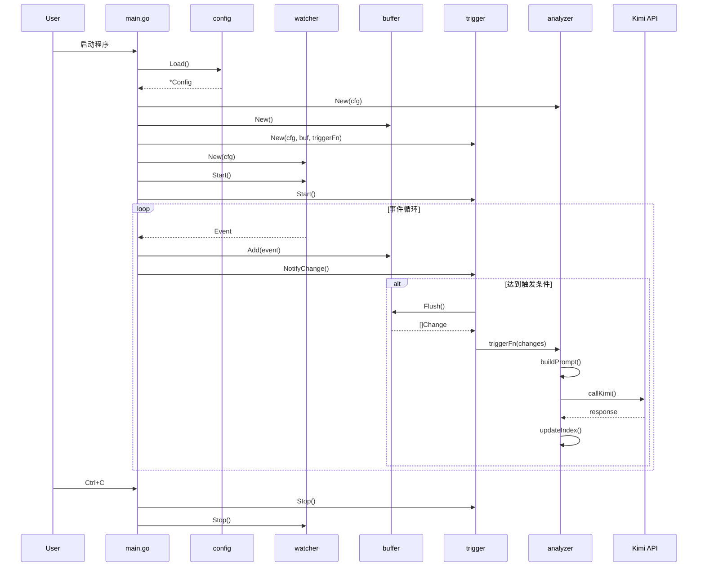
```mermaid
sequenceDiagram
    participant User
    participant Main as main.go
    participant Config as config
    participant Watcher as watcher
    participant Buffer as buffer
    participant Trigger as trigger
    participant Analyzer as analyzer
    participant Kimi as Kimi API

    User->>Main: 启动程序
    Main->>Config: Load()
    Config-->>Main: *Config

    Main->>Analyzer: New(cfg)
    Main->>Buffer: New()
    Main->>Trigger: New(cfg, buf, triggerFn)
    Main->>Watcher: New(cfg)

    Main->>Watcher: Start()
    Main->>Trigger: Start()

    loop 事件循环
        Watcher-->>Main: Event
        Main->>Buffer: Add(event)
        Main->>Trigger: NotifyChange()

        alt 达到触发条件
            Trigger->>Buffer: Flush()
            Buffer-->>Trigger: []Change
            Trigger->>Analyzer: triggerFn(changes)
            Analyzer->>Analyzer: buildPrompt()
            Analyzer->>Kimi: callKimi()
            Kimi-->>Analyzer: response
            Analyzer->>Analyzer: updateIndex()
        end
    end

    User->>Main: Ctrl+C
    Main->>Trigger: Stop()
    Main->>Watcher: Stop()
```

### 7.2 单次扫描模式

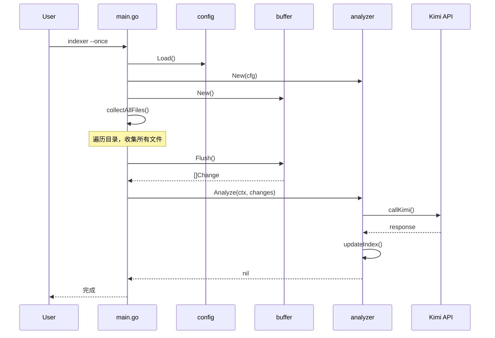
```mermaid
sequenceDiagram
    participant User
    participant Main as main.go
    participant Config as config
    participant Buffer as buffer
    participant Analyzer as analyzer
    participant Kimi as Kimi API

    User->>Main: indexer --once
    Main->>Config: Load()
    Main->>Analyzer: New(cfg)
    Main->>Buffer: New()

    Main->>Main: collectAllFiles()
    Note over Main: 遍历目录，收集所有文件

    Main->>Buffer: Flush()
    Buffer-->>Main: []Change

    Main->>Analyzer: Analyze(ctx, changes)
    Analyzer->>Kimi: callKimi()
    Kimi-->>Analyzer: response
    Analyzer->>Analyzer: updateIndex()

    Analyzer-->>Main: nil
    Main-->>User: 完成
```

---

## 8. 索引输出结构

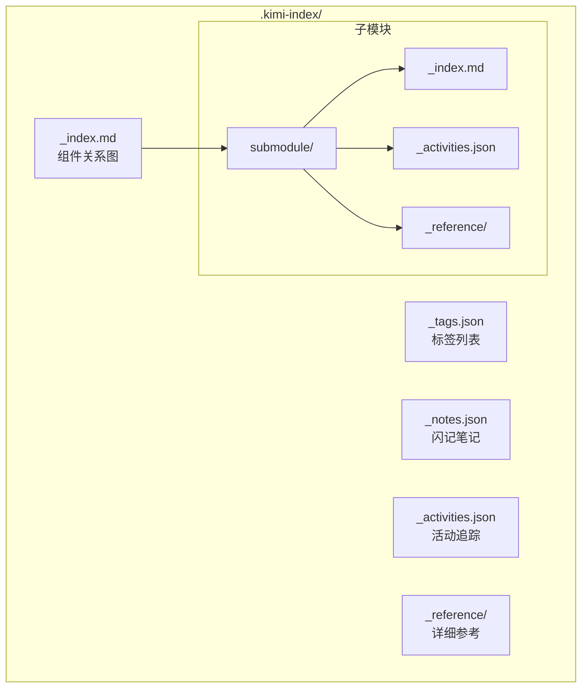
```mermaid
graph TD
    subgraph ".kimi-index/"
        A[_index.md<br/>组件关系图]
        B[_tags.json<br/>标签列表]
        C[_notes.json<br/>闪记笔记]
        D[_activities.json<br/>活动追踪]
        E[_reference/<br/>详细参考]

        subgraph "子模块"
            F[submodule/]
            G[_index.md]
            H[_activities.json]
            I[_reference/]
        end
    end

    A --> F
    F --> G
    F --> H
    F --> I
```

---

## 9. 错误处理流程

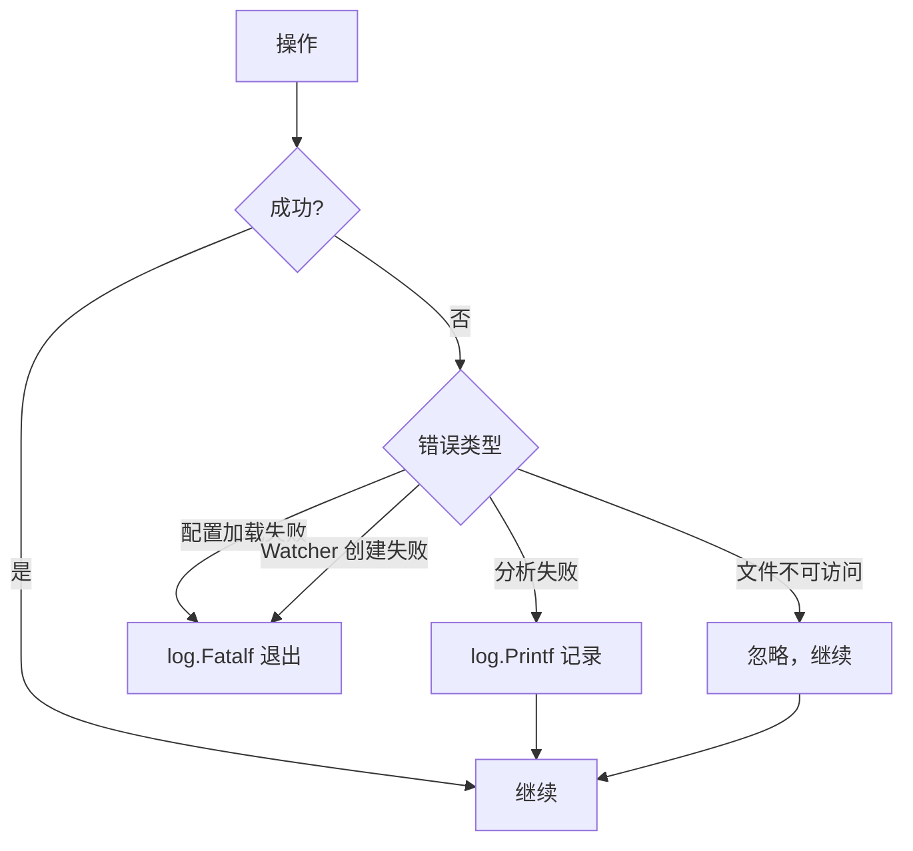
```mermaid
flowchart TD
    A[操作] --> B{成功?}
    B -->|是| C[继续]
    B -->|否| D{错误类型}

    D -->|配置加载失败| E[log.Fatalf 退出]
    D -->|Watcher 创建失败| E
    D -->|分析失败| F[log.Printf 记录]
    D -->|文件不可访问| G[忽略，继续]

    F --> C
    G --> C
```

---

## 10. 外部依赖

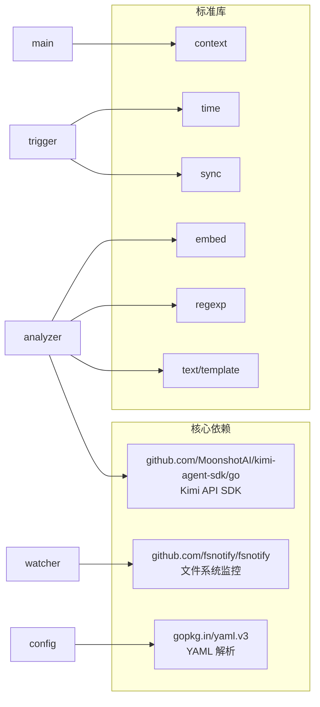
```mermaid
graph LR
    subgraph "核心依赖"
        A[github.com/fsnotify/fsnotify<br/>文件系统监控]
        B[gopkg.in/yaml.v3<br/>YAML 解析]
        C[github.com/MoonshotAI/kimi-agent-sdk/go<br/>Kimi API SDK]
    end

    subgraph "标准库"
        D[context]
        E[sync]
        F[time]
        G[text/template]
        H[regexp]
        I[embed]
    end

    watcher --> A
    config --> B
    analyzer --> C
    analyzer --> G
    analyzer --> H
    analyzer --> I
    trigger --> E
    trigger --> F
    main --> D
```

---

## 11. 总结

| 模块 | 文件 | 核心职责 |
|------|------|----------|
| **cmd/indexer** | main.go | CLI 入口，模式调度，事件循环 |
| **config** | config.go | 配置加载、保存、默认值 |
| **watcher** | watcher.go | 文件系统监控，事件过滤 |
| **buffer** | buffer.go | 变更去重、合并、缓冲 |
| **trigger** | trigger.go | 触发策略（阈值+空闲超时） |
| **analyzer** | analyzer.go | 构建 Prompt，调用 Kimi，更新索引 |
| **prompts** | analyze.md | 分析提示词模板 |

