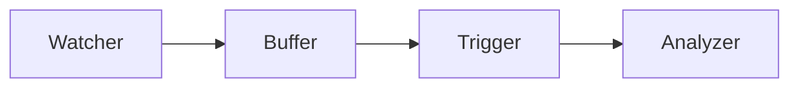

# Kimi Indexer - Design Document

> 本文档记录了原有 `core` 模块的设计和功能，供重构参考。

## 概述

Kimi Indexer 是一个代码语义索引工具，通过监听文件变更并调用 Kimi Agent SDK 分析代码，自动生成和维护项目的语义索引。

## 原有架构

### 模块结构

```
core/
├── cmd/indexer/main.go     # CLI 入口
└── internal/
    ├── analyzer/           # 分析器：调用 Kimi API 生成索引
    │   ├── analyzer.go
    │   ├── prompts/        # 提示词模板
    │   │   ├── analyze.md
    │   │   └── feedback.md
    │   └── schemas/        # JSON Schema 定义
    │       ├── tags.schema.json
    │       ├── notes.schema.json
    │       └── activities.schema.json
    ├── buffer/             # 变更缓冲器
    │   └── buffer.go
    ├── config/             # 配置管理
    │   └── config.go
    ├── logger/             # 日志模块
    │   └── logger.go
    ├── trigger/            # 触发器管理
    │   └── trigger.go
    └── watcher/            # 文件监控
        └── watcher.go
```

### 数据流

```
┌─────────────┐     ┌─────────────┐     ┌─────────────┐     ┌─────────────┐
│   Watcher   │────▶│   Buffer    │────▶│   Trigger   │────▶│  Analyzer   │
│  (fsnotify) │     │ (聚合变更)  │     │ (触发策略)  │     │ (Kimi API)  │
└─────────────┘     └─────────────┘     └─────────────┘     └─────────────┘
                                                                   │
                                                                   ▼
                                                           ┌─────────────┐
                                                           │   .kimi-    │
                                                           │   index/    │
                                                           └─────────────┘
```

---

## 模块设计

### 1. Watcher (文件监控)

**职责**：监控指定目录的文件变更事件

**核心功能**：
- 基于 `fsnotify` 实现递归目录监控
- 支持忽略模式（如 `node_modules`, `.git`）
- 支持扩展名过滤（如 `.go`, `.ts`, `.py`）
- 事件类型：Create, Modify, Delete, Rename

**接口设计**：
```go
type Event struct {
    Path string
    Type EventType  // Create, Modify, Delete, Rename
}

type Watcher interface {
    Start() error
    Stop() error
    Events() <-chan Event
}
```

---

### 2. Buffer (变更缓冲)

**职责**：聚合文件变更事件，合并重复变更

**核心功能**：
- 事件去重：同一文件的多次变更合并为一条
- 变更合并规则：
  | Old    | New    | Result |
  |--------|--------|--------|
  | create | modify | create |
  | create | delete | remove |
  | modify | modify | modify |
  | modify | delete | delete |
  | delete | create | modify |

**接口设计**：
```go
type Change struct {
    Path string
    Type ChangeType  // Create, Modify, Delete
}

type Buffer interface {
    Add(event Event)
    Count() int
    Flush() []Change
    IsEmpty() bool
}
```

---

### 3. Trigger (触发器)

**职责**：决定何时触发分析

**触发策略**：
- **文件数阈值**：当变更文件数达到 `minFiles` 时立即触发
- **空闲超时**：当 `idleMs` 毫秒内无新变更时触发
- **退出前触发**：程序退出前处理剩余变更

**接口设计**：
```go
type TriggerFunc func(changes []Change)

type Trigger interface {
    Start()
    Stop()
    NotifyChange()
    ForceTrigger()
}
```

---

### 4. Analyzer (分析器)

**职责**：调用 Kimi API 分析代码变更，生成语义索引

**核心功能**：
- 构建分析提示词（包含变更内容、当前索引结构、Schema 参考）
- 调用 Kimi Agent SDK 进行多轮对话
- 解析响应并写入索引文件
- **迭代验证机制**：最多 3 轮迭代，每轮验证后反馈错误

**验证规则**：
- **结构验证 (STRUCT-\*)**：检查必需文件是否存在
- **JSON Schema 验证 (JSON-\*)**：使用 `gojsonschema` 校验
- **交叉引用验证 (XREF-\*)**：标签定义、子模块路径

**接口设计**：
```go
type Analyzer interface {
    Analyze(ctx context.Context, changes []Change) error
    InitIndex(ctx context.Context) error
}
```

---

### 5. Config (配置管理)

**职责**：加载和管理配置

**配置结构**：
```yaml
watcher:
  root: "."                           # 监控根目录
  ignore:                             # 忽略列表
    - node_modules
    - .git
    - dist
    - .kimi-index
  extensions:                         # 监控的文件扩展名
    - .ts
    - .js
    - .go
    - .py

trigger:
  minFiles: 5                         # 文件数阈值
  idleMs: 30000                       # 空闲超时 (ms)

index:
  path: ".kimi-index"                 # 索引输出目录
  maxNotes: 50                        # 最大笔记数
  maxTags: 100                        # 最大标签数
  maxTypes: 100                       # 最大 activity 类型数
```

---

### 6. Logger (日志)

**职责**：提供多级别、可美化的 CLI 日志输出

**特性**
- 支持 `Debug / Info / Warn / Error / Silent` 阈值过滤。
- Debug 级别默认彩色显示，自动对多行消息分行，并使用 `┬/├/└` 等连接符保持结构化可读性。
- 可通过 `WithComponent("watch")` 等方式标记组件来源，方便定位。
- Writer、时间格式、彩色输出均可配置；提供 `NewNop()` 便于在测试或静默模式下屏蔽日志。

---

## 索引格式规范

### 目录结构

```
.kimi-index/
├── _index.md           # [必需] 根索引：组件关系图 + 子模块导航
├── _tags.json          # [必需] 全局标签定义（仅根目录）
├── _notes.json         # [必需] 闪记笔记（仅根目录）
├── _activities.json    # [必需] 根级活动追踪
├── _reference/         # [可选] 详细参考文档
│   └── *.md
└── <submodule>/        # [可选] 子模块目录
    ├── _index.md       # [必需] 子模块索引
    ├── _activities.json # [必需] 子模块活动
    └── _reference/     # [可选] 子模块参考文档
```

### 文件格式

#### `_index.md`

- 必须包含一级标题 `# <模块名>`
- 必须包含 Mermaid 图表展示组件关系
- 使用表格列出子模块和参考文档链接

```markdown
# Core Module

## Component Relationships



## Submodules

| Module | Description |
|--------|-------------|
| [watcher](./watcher/) | File system monitoring |
```

#### `_tags.json`

全局标签定义，仅存在于根目录。

```json
["todo", "bug", "feature", "refactor"]
```

#### `_notes.json`

闪记笔记，仅存在于根目录。

```json
[
  {
    "id": "uuid-v4",
    "content": "笔记内容",
    "tags": ["tag1"],
    "createdAt": "2024-01-01T00:00:00Z"
  }
]
```

#### `_activities.json`

活动追踪，每个模块目录都可以有。

```json
{
  "todo": {
    "items": [
      {"content": "待办内容", "tags": ["feature"], "priority": "high"}
    ],
    "children": ["submodule1"]
  }
}
```

---

## JSON Schemas

### tags.schema.json

```json
{
  "$schema": "http://json-schema.org/draft-07/schema#",
  "type": "array",
  "items": {
    "type": "string",
    "pattern": "^[a-z][a-z0-9-]*$"
  },
  "uniqueItems": true,
  "maxItems": 100
}
```

### notes.schema.json

```json
{
  "$schema": "http://json-schema.org/draft-07/schema#",
  "type": "array",
  "items": {
    "type": "object",
    "properties": {
      "id": {"type": "string", "format": "uuid"},
      "content": {"type": "string", "minLength": 1, "maxLength": 10000},
      "tags": {"type": "array", "items": {"type": "string", "pattern": "^[a-z][a-z0-9-]*$"}},
      "createdAt": {"type": "string", "format": "date-time"},
      "updatedAt": {"type": "string", "format": "date-time"}
    },
    "required": ["content"]
  },
  "maxItems": 50
}
```

### activities.schema.json

```json
{
  "$schema": "http://json-schema.org/draft-07/schema#",
  "type": "object",
  "additionalProperties": {
    "type": "object",
    "properties": {
      "items": {
        "type": "array",
        "items": {
          "type": "object",
          "properties": {
            "content": {"type": "string"},
            "tags": {"type": "array", "items": {"type": "string"}},
            "file": {"type": "string"},
            "line": {"type": "integer", "minimum": 1},
            "priority": {"enum": ["low", "medium", "high", "critical"]},
            "status": {"enum": ["open", "in-progress", "resolved", "closed"]}
          },
          "required": ["content"]
        }
      },
      "children": {
        "type": "array",
        "items": {"type": "string", "pattern": "^[a-z][a-z0-9-/]*$"}
      }
    },
    "required": ["items", "children"]
  },
  "propertyNames": {"pattern": "^[a-z][a-z0-9-]*$"}
}
```

---

## CLI 接口

```bash
# 初始化索引目录
indexer --init

# 单次扫描
indexer --once

# 持续监控模式（默认）
indexer

# 指定配置文件
indexer --config path/to/config.yaml

# 覆盖配置
indexer --root /path/to/project --index /path/to/output

# 日志级别
indexer --log debug
```

---

## 依赖

- `github.com/MoonshotAI/kimi-agent-sdk/go` - Kimi Agent SDK
- `github.com/fsnotify/fsnotify` - 文件系统监控
- `github.com/xeipuuv/gojsonschema` - JSON Schema 验证
- `gopkg.in/yaml.v3` - YAML 解析

---

## 重构建议

1. **模块解耦**：考虑使用接口定义模块边界，便于测试和替换实现
2. **错误处理**：统一错误处理策略，考虑使用 structured errors
3. **测试覆盖**：为每个模块添加单元测试
4. **配置验证**：启动时验证配置的有效性
5. **性能优化**：大项目可考虑并行分析、增量索引
6. **日志改进**：考虑使用 structured logging (如 slog)
